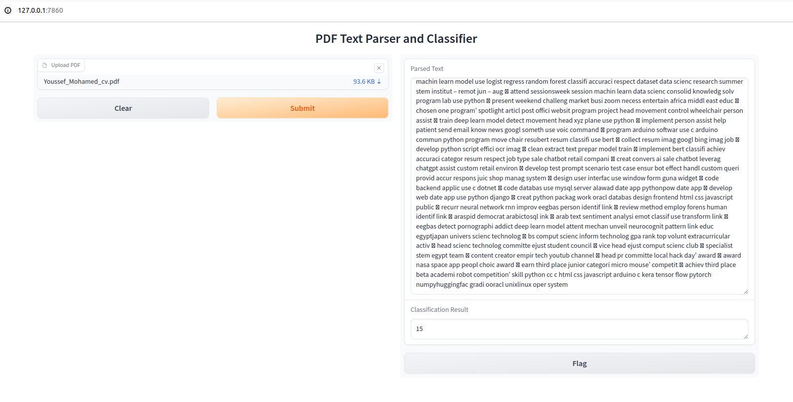

# Web browser using python 

## Description

Demo app for Resume classification


## Usage

### Step 1: Create a Virtual Python Environment

First, create a new virtual environment to ensure all dependencies are isolated from your main Python installation.

```bash
conda create -n resume-atlas python=3.8
```

### Step 2: Activate the Environment

```bash
conda activate resume-atlas
```

### Step 3: Install the Requirements

```bash
pip install -r requirements.txt
```

### step 4: install nltk package 
```bash
python modules/install_stop_words.py
```

### step 5: Run the app 
```bash
python app.py
```
copy the following URL to your browser
```bash
http://127.0.0.1:7860
```

### DEMO 


### Notes:

- if their is any problem in torch installation please use the following [website](https://pytorch.org/get-started/locally/) for installation 


## Contribution
Contributions are welcome! If you find any issues or have suggestions for improvement, please create an issue or submit a pull request on the project's GitHub repository.